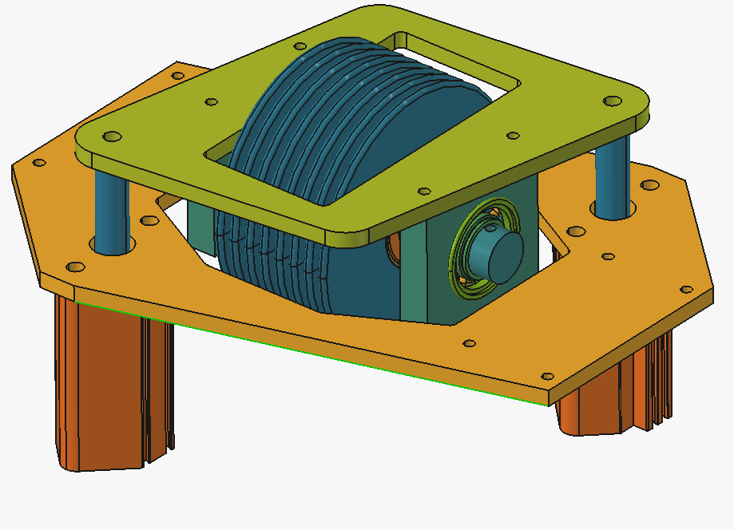
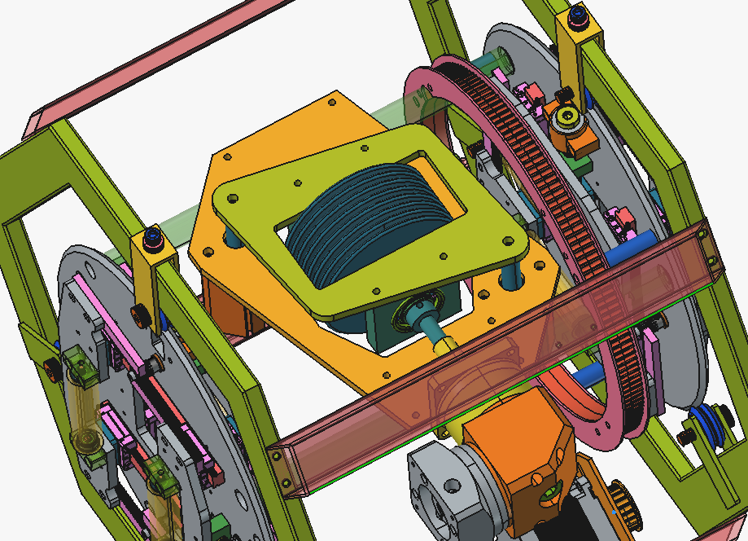
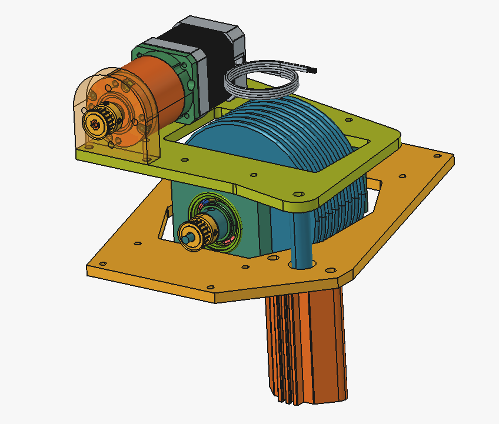

# The-Tube-Mangler
Looking to create a CNC plasma tube notcher &amp; pen plotter to work with 1/2" -> 2" tubing. 

# Path to success
## Step 1 
Mechanical design surrounding the pen plotting/ clamping/ rotating and movement of the tubing

### Axial Roller Drive Math
Outside of literally just trying to fit everything into one small space, we've run into our first issue that requires some brain cells.

The [non slip roller](https://www.mcmaster.com/2494K18/) in the center is has a OD = 4" and the two [air cylinders](https://www.mcmaster.com/62245K166/) have a 1" bore.
At 90 psi we are putting *2 x 90 lbs/in^2 x pi(0.5)^2 in^2 = **141.37** lbs* of force down on this roller. There are two main problems to solve here:

1. Will this "non slip" roller actually not slip at 141 lbs of downforce?
2. Will a stepper motor setup for direct drive stall without some kind of reduction to the non-slip roller?  

Answers:
1. AI says its fine and this feels like more of a "find out" scenario
2. *t = F x r, r = 0.0508m (2in), t = 3 Nm* (big boy stepper), with that we would get *F = 59N = 13lbf*. If we want to chuck up a full 20ft stick of 3"x3" 1/4" thick piece
of tubing at 176lbs, we'd have a hard time doing so with 13lbf. **We need a significant reduction** 

Right angle gearbox above was my first thought but it doesnt fit super well. If I downsize to a Nema 17 motor and use a straight 100:1 and using the same sized pulley
to connect the gear box to the roller I think the fit is just about right:

 
## Step 2 
Addition of plasma cutter

## Step 3
Add the ability --software wise-- to cut square tube
